# Mini Project — Exploratory Data Analysis on India's COVID-19 Data

*State-wise trends, recovery/death rates, and vaccination progress — full code walkthrough and written findings*

**Tools used:** Python, Pandas, NumPy, Matplotlib, Seaborn
**Data sources:** [imdevskp/covid-19-india-data](https://github.com/imdevskp/covid-19-india-data) (case data) and [Our World in Data](https://github.com/owid/covid-19-data) (vaccination data)

---

## 1. Objective

The goal of this mini project is to take a real, publicly available, slightly messy
dataset about India's COVID-19 outbreak and turn it into a clear picture of what
happened, state by state, over time — using Pandas, NumPy, and Matplotlib/Seaborn.

Two datasets are used together:

- **Case data** — daily, state-wise confirmed cases, deaths, and recoveries, covering
  30 January 2020 to 6 August 2020 (India's first wave).
- **Vaccination data** — India's national daily vaccination totals from Our World in
  Data, covering January 2021 onward, once the vaccine rollout began.

> **Note:** These two datasets don't overlap in time — the case data ends before
> vaccines existed. They are treated here as two chapters of the same story: how the
> outbreak spread, and how the public health response scaled up afterward.

---

## 2. Step-by-Step Workflow

### Step 1 — Load the data

Both datasets are read directly from their public GitHub/OWID URLs with
`pandas.read_csv()` — no manual download required.

```python
import pandas as pd

cases = pd.read_csv(
    "https://raw.githubusercontent.com/imdevskp/covid-19-india-data/master/complete.csv"
)
vax = pd.read_csv(
    "https://raw.githubusercontent.com/owid/covid-19-data/master/public/data/vaccinations/country_data/India.csv"
)
```

### Step 2 — Inspect before touching anything

```python
cases.dtypes
cases.isna().sum()
cases["Name of State / UT"].nunique()
```

This inspection immediately reveals two real-world data problems:

1. The `Death` column is stored as **text**, not a number.
2. The same state is spelled multiple ways — e.g. `Telangana`, `Telengana`, and
   `Telangana***` are all one state, and some Union Territories appear twice (once
   plain, once prefixed with "Union Territory of ...").

### Step 3 — Clean

```python
cases.columns = [
    "date", "state", "lat", "long", "confirmed",
    "deaths", "cured", "new_cases", "new_deaths", "new_recovered",
]
cases["date"] = pd.to_datetime(cases["date"])
cases["deaths"] = pd.to_numeric(cases["deaths"], errors="coerce").fillna(0).astype(int)

name_fix = {
    "Telangana***": "Telangana",
    "Telengana": "Telangana",
    "Union Territory of Jammu and Kashmir": "Jammu and Kashmir",
    "Union Territory of Ladakh": "Ladakh",
    "Union Territory of Chandigarh": "Chandigarh",
}
cases["state"] = cases["state"].replace(name_fix)
cases = cases.drop_duplicates(subset=["date", "state"])
cases["active"] = cases["confirmed"] - cases["deaths"] - cases["cured"]
```

> **Key idea:** clean once, at the start, before any grouping or plotting. Fixing a
> spelling mistake *after* a `groupby("state")` would leave every earlier chart
> silently wrong.

### Step 4 — Explore with `groupby` and `pivot_table`

```python
national = cases.groupby("date", as_index=False)[["confirmed", "deaths", "cured"]].sum()
national["recovery_rate"] = (national["cured"] / national["confirmed"] * 100).round(2)
national["new_confirmed_7d_avg"] = national["confirmed"].diff().rolling(7).mean()

latest = cases[cases["date"] == cases["date"].max()].sort_values("confirmed", ascending=False)

cases["month"] = cases["date"].dt.strftime("%Y-%m")
pivot = cases.pivot_table(values="new_cases", index="state", columns="month", aggfunc="sum", fill_value=0)
```

### Steps 5 & 6 — Visualise and summarise

The rest of this report is Steps 5 and 6: twelve charts built with Matplotlib and
Seaborn, followed by a written summary of what they show.

---

## 3. Charts and Findings

### 3.1 National trends over time

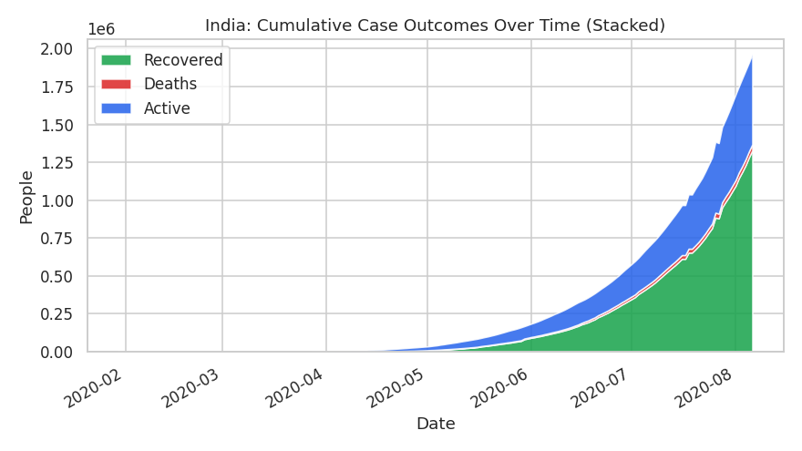

*Figure 1: Cumulative confirmed cases split into recovered / active / deaths, nationally.*

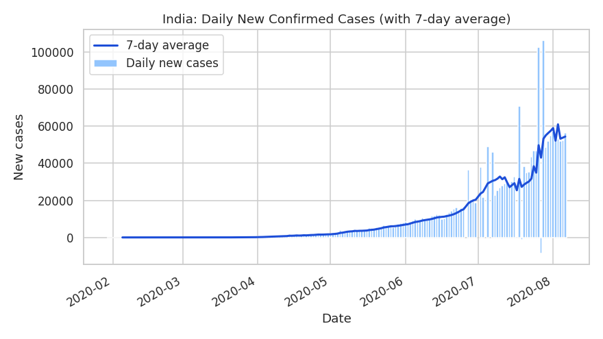

*Figure 2: Daily new confirmed cases, with a 7-day rolling average line to smooth out day-to-day reporting noise.*

> **Finding:** By 6 August 2020, India had recorded about **19.6 lakh (1.96 million)**
> confirmed cases, **13.3 lakh** recoveries, and roughly **40,700** deaths. The 7-day
> average makes it clear the daily new-case count was still **rising steadily** at the
> end of the data window — it had crossed 100,000 new cases on its highest day in late
> July 2020 — so the first wave had not yet crested by this point.

### 3.2 Which states were hit hardest?

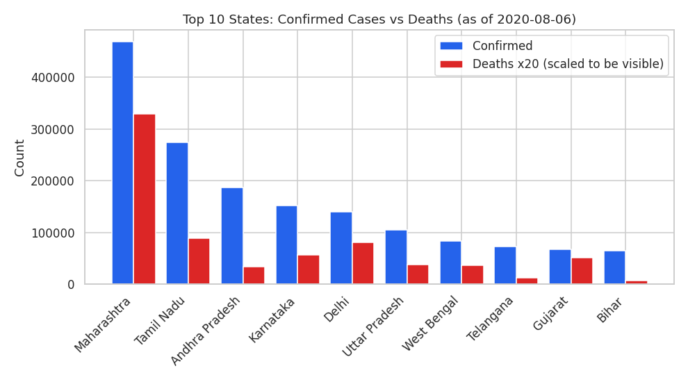

*Figure 3: Top 10 states by confirmed cases, with deaths shown alongside (scaled ×20 to stay visible on the same axis).*

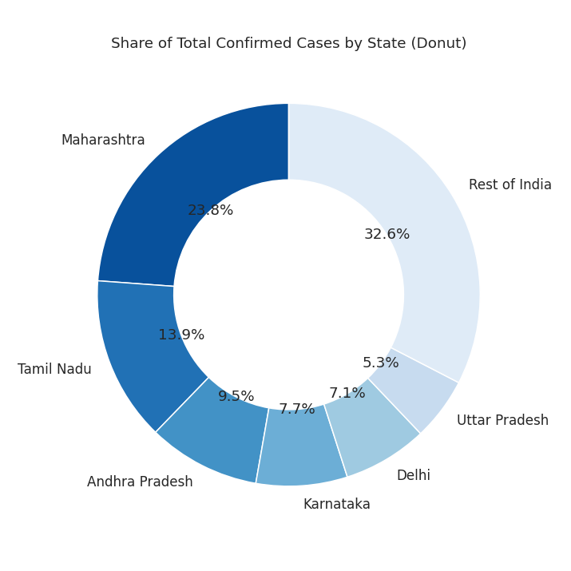

*Figure 4: Share of national confirmed cases held by the top states.*

> **Finding:** The outbreak was heavily concentrated, not evenly spread. **Maharashtra**
> alone accounted for close to a **quarter** of all national cases (~4.68 lakh), with
> **Tamil Nadu, Andhra Pradesh, Karnataka**, and **Delhi** rounding out the top five.
> Together, the **top 6 states** held roughly **two-thirds** of the country's total
> case load.

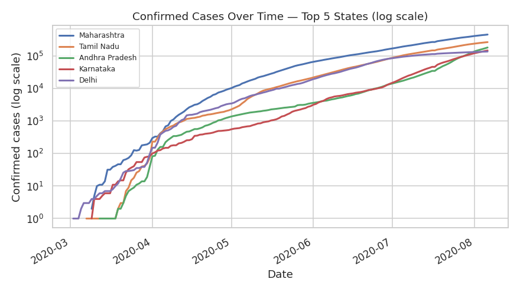

*Figure 5: Confirmed-case growth curves for the top 5 states, plotted on a log scale — this makes it easier to compare early growth rates across states of very different sizes.*

### 3.3 Recovery and death rates

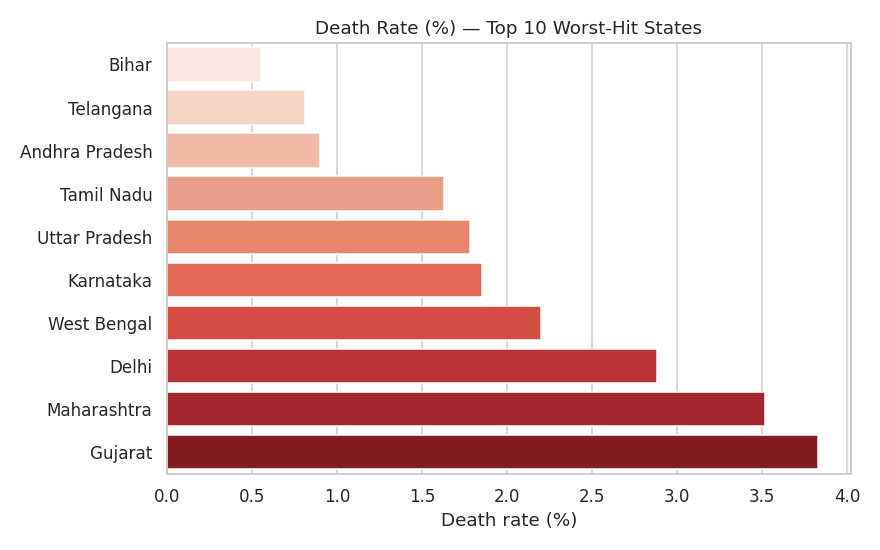

*Figure 6: Death rate (%) for the ten worst-hit states.*

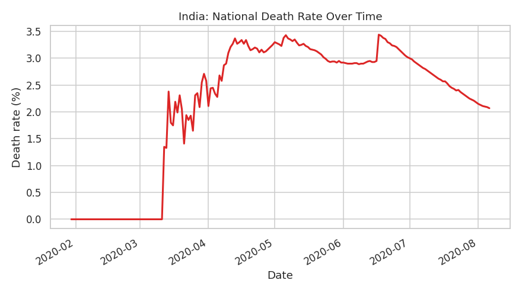

*Figure 7: National death rate over time.*

> **Finding:** Among the worst-hit states, **Gujarat** had the highest death rate, at
> nearly **3.8%** — noticeably above the roughly 2.1% national average — while
> lower-case states like **Bihar** and **Telangana** had death rates under 1%. This
> kind of gap is worth digging into further: differences in health infrastructure, age
> demographics, and testing intensity could all be contributing factors, though this
> dataset alone can't tell us which.
>
> Recovery followed the opposite pattern to some extent: **Delhi** stood out with a
> recovery rate near **90%**, while **Karnataka** was still under 50% recovered at
> this snapshot — likely because Karnataka's outbreak was comparatively newer/faster
> growing relative to how much time patients had had to recover.

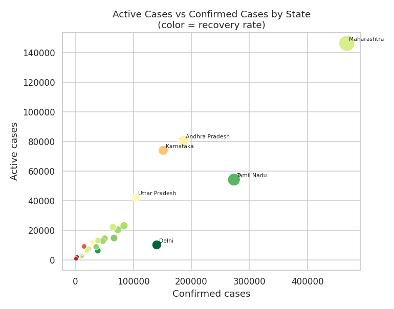

*Figure 8: Active cases vs total confirmed cases by state, colored by recovery rate — states further to the top-right with cooler colors still had a lot of active, unresolved cases relative to their size.*

### 3.4 How metrics relate to each other, and how the outbreak evolved month by month

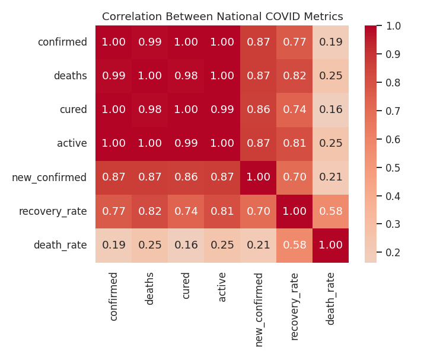

*Figure 9: Correlation between national COVID-19 metrics.*

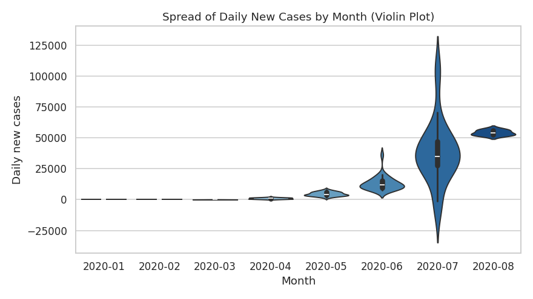

*Figure 10: Spread of daily new cases, by month (violin plot — the width of each shape shows how common that range of daily case counts was in that month).*

> **Finding:** The monthly violin plot makes the acceleration obvious: both the
> **typical** daily case count and its **spread** grew every month from February to
> August 2020, with July and August showing the widest range of daily new cases — a
> visual confirmation that the outbreak's pace, and its day-to-day volatility, both
> increased over the period covered.

### 3.5 The other end of the spectrum, and the vaccination follow-up

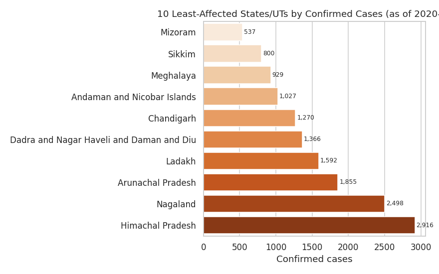

*Figure 11: The ten least-affected states/UTs by confirmed case count.*

> **Finding:** Small northeastern states and union territories, along with the
> Andaman & Nicobar Islands, recorded the fewest cases — each under a few thousand
> total confirmed cases by August 2020 — likely reflecting both smaller populations
> and lower population density/connectivity.

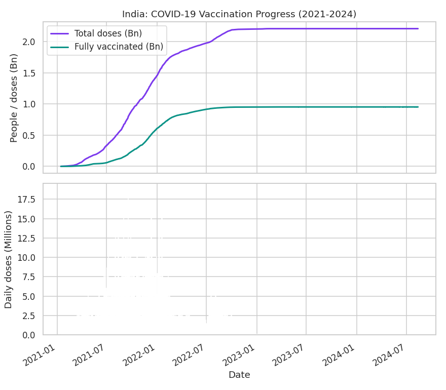

*Figure 12: India's national vaccination progress, 2021–2024 (OWID data), showing both the cumulative totals and daily doses administered.*

> Looking ahead to the vaccination data: by mid-2024, India had administered over
> **2.2 billion** vaccine doses and fully vaccinated more than **950 million** people
> — illustrating the scale of the public health response that followed the wave
> captured in this project's case data.

---

## 4. Overall Summary

- The dataset covers **35 states/UTs** (after cleaning up duplicate name spellings)
  across **186 days**, from 30 January to 6 August 2020.
- India's first wave was **still accelerating** at the end of this window — confirmed
  cases were growing, and the daily new-case count had not yet peaked.
- The outbreak's impact was **far from uniform** across states: a handful of states
  carried the large majority of the case load, while several smaller states/UTs stayed
  in the low thousands.
- Recovery and death rates both **varied meaningfully** by state, hinting at real
  differences in healthcare capacity, testing, and demographics worth investigating
  with additional data.
- The vaccination rollout that followed (2021 onward) reached over **2.2 billion**
  doses administered by 2024 — a reminder that this case dataset captures only the
  opening chapter of India's COVID-19 response.

### 4.1 Caveats

This is state-bulletin-sourced data, so it inherits whatever inconsistencies existed
in how individual states reported their numbers (hence the spelling and
text-formatted `Death` column issues fixed in Step 3). Recovery and death rates here
are simple ratios of cumulative totals on a single date, not adjusted for reporting
lag or right-censoring, so they should be read as directional trends rather than
precise clinical outcome rates.

### 4.2 Suggestions for further analysis

- Bring in state population figures to convert raw case counts into per-capita rates
  for a fairer state-to-state comparison.
- Join district-level data (also available in the same source repository) to see
  which cities, not just states, drove the national numbers.
- Extend the case time series past August 2020 (using a more recent source) to see
  the full shape of India's first and second waves side by side.

---

*Data Science mini project — see `covid19_india_eda.ipynb` for the full runnable notebook.*
